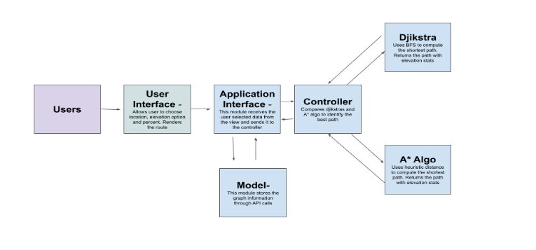

# EleNa---Elevation-Based-Navigation-System

EleNa is a user-friendly web application designed to assist hikers and trekkers in finding optimal routes between any two points on a map. With EleNa, users have the flexibility to customize their routes based on elevation preferences, allowing them to either maximize or minimize elevation changes. Additionally, EleNa provides a traditional shortest path route for comparison.

```
📦src
 ┣ 📂NetworkMetrics
 ┃ ┣ 📜config.py
 ┃ ┗ 📜graph_data_processor.py
 ┣ 📂RoutingAlgorithms
 ┃ ┣ 📜a_star.py
 ┃ ┣ 📜djikstra.py
 ┃ ┗ 📜routing_algorithms.py
 ┣ 📂static
 ┃ ┣ 📂css
 ┃ ┃ ┗ 📜style.css
 ┃ ┗ 📂js
 ┃ ┃ ┗ 📜map.js
 ┣ 📂templates
 ┃ ┗ 📜map.html
 ┣ 📂test
 ┃ ┣ 📜algorithmsTest.py
 ┃ ┣ 📜coverage_report.pdf
 ┃ ┣ 📜graphTest.py
 ┃ ┗ 📜unitTest.py
 ┣ 📜app.py
 ┗ 📜graph.p ```
 
## Setup

### Cloning the Repository

Begin by cloning the repository:
```bash
git clone https://github.com/Shaunak-umass/EleNa---Elevation-Based-Navigation-System.git
cd EleNa---Elevation-Based-Navigation-System
```


### Installing Required Libraries

The application requires the following libraries -
1. osmnx (1.3.0)
2. networkx (3.1)
3. Flask (2.3.2)
4. numpy (1.23.4)
5. geopy (2.3.0)
6. scikit-learn (1.2.2)

The requirements will be installed by running the following command:
```bash
pip install -r requirements.txt
```

## Execution

First go into the src directory:
```bash
cd src
```

Execute the application by running the following command:
```bash
python app.py
```

## Interacting with the application


- The left section allows users to make changes to the following configurations:
       Elevation Preference (Maximize or Minimize)
       Elevation max path limit (x percentage)
- By default these values are Maximize and 0%
- The users can select the source and destination by clicking on the map.
- Once the destination is clicked, the application will calculate the route and render it on the map.
- Users can see the result in the left section.
- The map will get reset when the user selects another source on the map.

## Tech Stack

Front end:
   HTML, CSS and JavaScript
   Leaflet
Back end:
   Flask (Python)
   NetworkX (Python)
   OSMnx (Python)

## Architecture



## Design Principles

- Loose Coupling and High Cohesion: Modules or components should have minimal dependencies on each other, while internally maintaining strong cohesion.
- Open-Closed Principle (OCP): Software entities (classes, modules, functions) should be open for extension but closed for modification.
- The Single Responsibility Principle (SRP) states that a class should have a single, well-defined responsibility or purpose, so that it has only one reason to undergo modifications or changes in the future.

## Non-functional Requirements

### Understandability
- Efficient naming conventions have been applied consistently for variables, functions, and classes throughout the code, facilitating easier comprehension and maintenance.
- The code has been enhanced with comprehensive comments, aiming to improve its readability and understandability.
- To promote modularity and reusability, functions and classes have been utilized whenever appropriate, enabling the code to be organized into logical components.

### Usability
- The design and user interface (UI) have been meticulously crafted to be comprehensive, providing a visually appealing experience for users.
- We have developed a straightforward and user-friendly layout that is easy to grasp and navigate. All the necessary information has been presented in a clear and concise manner, ensuring that users can quickly find what they are looking for.

### Accessibility
- The intuitive user interface (UI) has been designed with careful consideration for users with cognitive impairments, ensuring that they can easily understand and utilize the application's features.
- The utilization of larger fonts caters to users with visual impairments, enabling them to comfortably navigate and interact with the application.
- By incorporating alt texts on images, we have ensured that screen readers can accurately convey the content to visually impaired users, providing them with equal access to information.

### Testing
We have included custom tests to make sure our application is working properly. We have made sure to test each component separately.
The following files contain the tests:
- algorithmsTest.py
- graphTest.py
- unitTest.py

We also tested the coverage of our code and the coverage report has been provided in the test directory.

## Dragon Blasters

- `Shaunak Padhye`
- `Shreya Dubey`
- `Harshitha Kumarasubramanian`
- `Nithyasri Laxminarasimhan`
